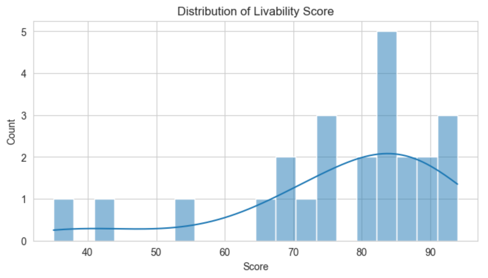
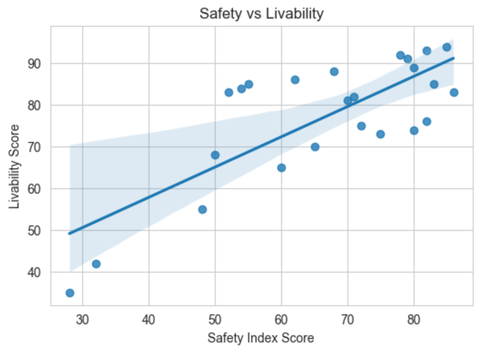
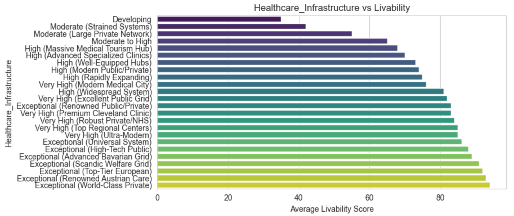
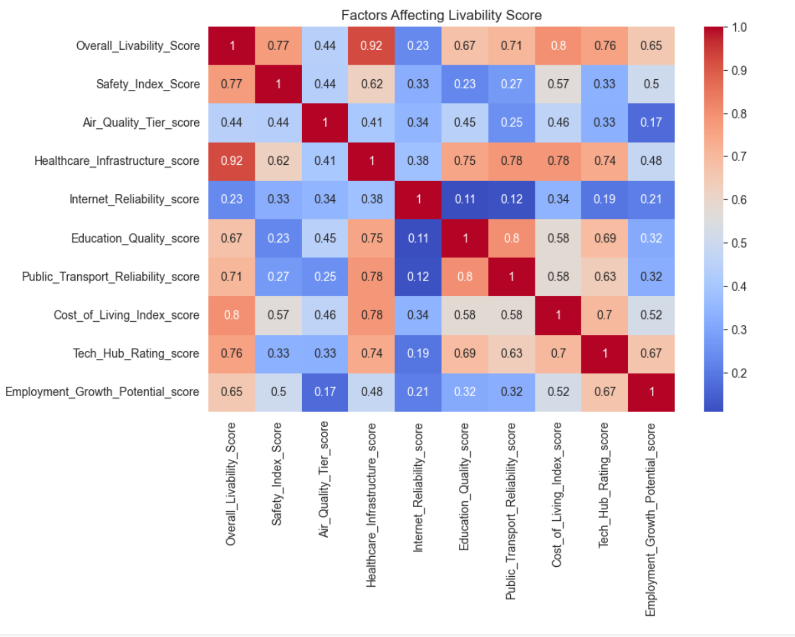
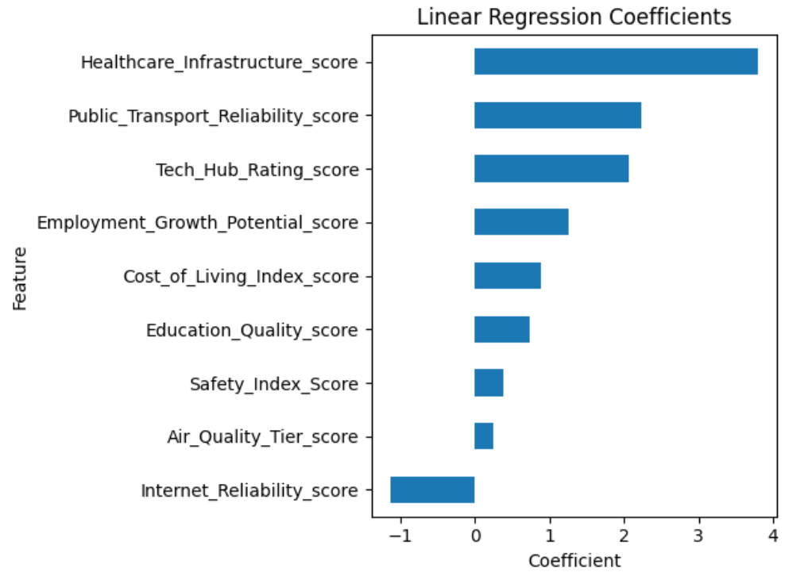
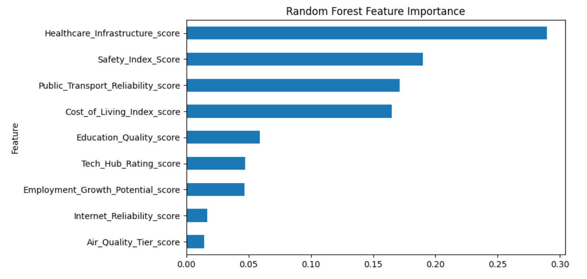

# 🌆 urban-intelligence

---

## 🧠 One-Sentence Summary  
This project analyzes and predicts urban livability scores using machine learning models based on city infrastructure, environmental, and socioeconomic indicators.

---

## 📌 Overview  
This project explores the factors that influence **urban livability** and builds predictive models to estimate the **Overall Livability Score** of global cities.

The problem is treated as a **regression task**, where the goal is to predict a continuous score based on city-level features such as safety, healthcare, cost of living, and infrastructure.

Two models are used:
- Linear Regression (baseline model)
- Random Forest Regressor (non-linear comparison model)

The focus is on both prediction and interpretability of urban factors.

---

## 📊 Dataset
- **Source:** Kaggle global-cities-lifestyle-and-tech-infrastructure dataset 
- **Type:** Tabular dataset (CSV)  
- **Size:** 24 cities  
- **Target Variable:** Overall Livability Score  
- **Key Features:** Safety Index, Healthcare Infrastructure, Green Spaces, Cost of Living, Employment Growth, Internet Reliability, Education Quality, Tech Hub Rating, Public Transport, Climate Type, Community Vibe, Migration Rate
- **No missing values or duplicates**

---

## 🔎 Exploratory Data Analysis (EDA)

Key insights:

- Livability scores show moderate variation across cities  
- Safety Index strongly correlates with livability  
- Infrastructure features are highly influential  
- Categorical variables were encoded into ordinal numeric values  

---

## 📈 Visualizations

### Livability Score Distribution

### Safety vs Livability

### Feature Distributions

### Correlation Heatmap

---

## ⚙️ Data Preprocessing

- No missing values or duplicates  
- Encoded categorical variables into ordinal scores  
- Selected key features based on EDA  
- Built final modeling dataset  

---

## 🤖 Modeling Approach

### Problem Type:
Regression

### Models:
- Linear Regression
- Random Forest Regressor

### Metrics:
- Mean Absolute Error (MAE)
- R² Score

---

## 📊 Model Performance

| Model              | MAE  | R² Score |
|-------------------|------|----------|
| Linear Regression | 3.36 | 0.71     |
| Random Forest     | 3.68 | 0.66     |

---

## 📉 Linear Regression Coefficients

---

## 🌲 Random Forest Feature Importance

---

## 🧠 Key Insights

- Healthcare infrastructure is the strongest predictor of livability  
- Safety index is consistently highly influential  
- Public transportation and cost of living are also factors that matter significantly  
- Linear relationships dominate this dataset  

---

## 📌 Conclusions

- Machine learning models can approximate urban livability scores effectively  
- Linear Regression performed slightly better than Random Forest  
- Infrastructure and safety are the dominant drivers of livability  
- Dataset is small but still reveals meaningful patterns  

---

## ⚠️ Limitations

- Small dataset (24 cities)  
- Simplified encoding of categorical variables  
- Results are exploratory, not production-level  

---

## 🚀 Future Improvements

- Expand dataset with more cities  
- Try XGBoost / LightGBM models  
- Improve feature engineering
- Add geographic clustering analysis  

---

## 📁 How to Reproduce

1. Clone repository  
2. Download dataset from Kaggle: https://www.kaggle.com/datasets/sohaibdevv/global-cities-lifestyle-and-tech-infrastructure
3. Place file in `/data` folder  
4. Install dependencies:
   - pandas
   - numpy
   - matplotlib
   - seaborn
   - scikit-learn  

5. Run notebooks in order:
   - `1_data_eda_visualizations.ipynb`
   - `2_data_modeling.ipynb`

---
Developed as a machine learning project with AI-assisted guidance for coding and debugging. The implementation was assembled, tested, and reviewed by me.